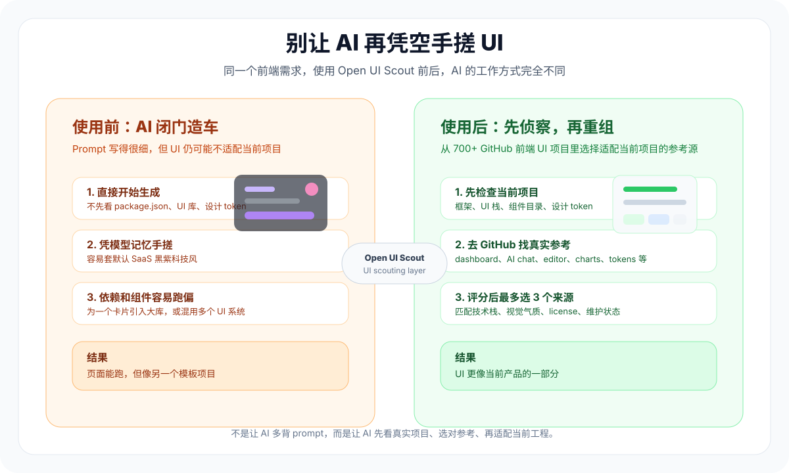

# Before / After: Open UI Scout 对比案例

[返回中文 README](README.md) · [English README](README.en.md)

这个页面展示同一个前端需求，在 **不使用 Open UI Scout** 和 **使用 Open UI Scout** 时，AI coding agent 的工作方式会有什么不同。

<p align="center">
  
</p>

## 示例需求

```text
帮我做一个 SaaS 数据 dashboard。
要高级、现代、响应式，有指标卡、趋势图、表格、筛选器和空状态。
```

这个 prompt 看起来已经很完整，但它仍然缺少几个决定 UI 成败的信息：

- 当前项目用什么框架和 UI 栈？
- 这是偏营销展示的 dashboard，还是高频使用的业务后台？
- 用户需要高信息密度，还是更重视觉冲击？
- 图表和表格应该用什么成熟方案？
- 能不能新增依赖？license 和维护状态是否适合？

## 不使用 Open UI Scout

AI 很容易直接开始写 UI。

| 环节 | 常见结果 |
| --- | --- |
| 需求理解 | 把“高级、现代”理解成通用 SaaS 黑紫渐变风 |
| 项目检查 | 不先看项目已有 UI 库、Tailwind 配置、组件目录和设计 token |
| 资源选择 | 凭模型记忆手搓卡片、表格、图表和动画 |
| 依赖处理 | 随手引入新的图表库或 UI 库，可能和项目已有体系冲突 |
| UI 结果 | 看起来能跑，但像另一个模板项目，不一定适合当前产品 |
| 后续维护 | 组件结构、状态、样式和可访问性需要人工返工 |

典型输出会出现这些问题：

- 指标卡很好看，但密度不适合真实业务后台。
- 表格没有 loading、empty、error、disabled、筛选和移动端状态。
- 图表颜色和项目主题不一致。
- 为了几个组件引入一整套新 UI 库。
- 视觉效果有了，但不像当前项目的一部分。

## 使用 Open UI Scout

Open UI Scout 会让 AI 先做一次 UI scouting，而不是直接手搓。

### 1. 先检查当前项目

AI 会先看：

- `package.json`
- 当前框架：Next.js / React / Vue / Nuxt / Svelte 等
- 样式方案：Tailwind、CSS Modules、SCSS、styled-components 等
- 已有 UI 库：shadcn/ui、Ant Design、MUI、Mantine、HeroUI 等
- 图标库、图表库、表格库、设计 token
- `components/`、`app/`、`src/`、`features/` 等目录结构

### 2. 再判断页面类型和产品气质

这个需求会被归类为：

```text
Page type: dashboard / analytics_page / data_table
Mood: premium_saas 或 enterprise，取决于产品上下文
Production constraints: responsive, accessible, low dependency conflict, maintainable
```

如果用户没有明确风格，而且上下文有多种可能，AI 会先问或给 2-3 个方向：

```text
你希望这个 dashboard 更像哪一种？
1. Premium SaaS：更轻、更现代，适合外部客户查看
2. Enterprise Ops：信息密度更高，适合内部高频操作
3. Calm Analytics：更安静克制，适合研究/数据产品
```

### 3. 从 GitHub 资源池选候选来源

Open UI Scout 会从 700+ GitHub 前端 UI 项目引用里选择候选，而不是凭空手搓。

示例候选：

| 角色 | 候选资源 | 为什么 |
| --- | --- | --- |
| Base UI | `shadcn-ui/ui` 或项目已有 UI 库 | 保持基础组件一致 |
| Dashboard pattern | `tremorlabs/tremor`, `TailAdmin/free-nextjs-admin-dashboard`, `tabler/tabler` | 参考成熟 dashboard 信息架构 |
| Table / Chart | `tanstack/table`, `recharts/recharts`, `apache/echarts` | 使用成熟数据展示方案 |

### 4. 给候选资源评分

```yaml
scoring:
  tech_stack_match: 0-5
  page_type_match: 0-5
  visual_mood_match: 0-5
  production_readiness: 0-5
  maintenance_activity: 0-5
  license_clarity: 0-5
  dependency_cost: 0-5
  style_conflict_risk: 0-5
  accessibility_support: 0-5
```

这一步能避免：

- 提示词写得很漂亮，但库和当前项目不适配。
- UI 看起来很酷，但依赖成本太高。
- 组件能展示，但缺少生产状态。
- 参考项目好看，但 license 或维护状态不适合。

### 5. 输出选择摘要

使用 Open UI Scout 后，AI 在写代码前应该先输出类似内容：

```text
Page type: dashboard / analytics_page
Mood: premium_saas, inferred from SaaS context
Current stack: Next.js + Tailwind + shadcn/ui
Selected base UI: shadcn-ui/ui
Selected pattern source: tremorlabs/tremor
Selected data source: tanstack/table + existing chart setup
Why: matches current stack, dashboard density, and low style conflict
Dependency risk: avoid adding a new full UI library; reuse existing components
Implementation direction: metric cards, filter bar, responsive table, chart panel, loading/empty/error states
```

## 对比结果

| 维度 | 不使用 Open UI Scout | 使用 Open UI Scout |
| --- | --- | --- |
| 起点 | 直接生成 UI | 先检查项目和 GitHub 参考源 |
| 风格 | 容易套默认科技风 | 根据页面类型和产品气质判断 |
| UI 来源 | 凭模型记忆手搓 | 从 700+ GitHub 项目里选候选 |
| 项目适配 | 容易像另一个模板 | 先匹配当前技术栈和组件体系 |
| 依赖 | 容易乱加库 | 最多 3 个主要 UI 来源，控制依赖成本 |
| 生产状态 | 经常漏 loading / empty / error | 明确检查状态、响应式和可访问性 |
| 版权意识 | 容易无意识复制模板 | 明确检查 license、维护状态和使用边界 |
| 最终效果 | prompt 对了，但项目不一定对 | UI 更像当前产品的一部分 |

## 一句话

Open UI Scout 的价值不是让 prompt 更玄学，而是让 AI 在写 UI 前先有审美来源、工程约束和项目上下文。

它把“AI 凭空生成页面”变成：

```text
先看真实项目 -> 选对参考 -> 评估适配性 -> 再为当前项目重组 UI
```
