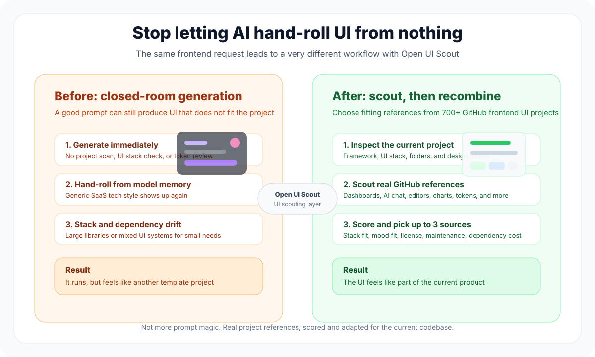

# Open UI Scout

<p align="center">
  <strong>Stop letting AI hand-roll UI from nothing</strong>
</p>

<p align="center">
  Open UI Scout helps AI understand the page, product mood, and stack first, then select references from high-quality open-source frontend projects on GitHub.
</p>

<p align="center">
  <a href="README.md">中文</a> · <a href="README.en.md">English</a> · <a href="#install">Install</a> · <a href="#resource-categories">Resource Categories</a> · <a href="RESOURCE_POOL.md">Full Resource Pool</a>
</p>

<p align="center">
  
  
  
  
</p>

---

## What It Is

Open UI Scout is not a prompt-writing guide.

It is a **UI scout skill** for Codex, Claude Code, Cursor, Windsurf, Gemini CLI, and similar coding agents: before generating frontend code, the agent studies mature, good-looking GitHub frontend projects, then recombines the right UI patterns for your page type, product mood, technical stack, and production constraints.

GitHub already has many mature dashboard, landing page, AI chat, editor workspace, mobile UI, icon, token, form, chart, and motion projects. Open UI Scout includes **700+ GitHub frontend UI project references** so AI can learn from real projects instead of inventing everything from scratch.

> Using references does not mean copying someone else's code. It means learning structure, component choices, visual rhythm, and interaction patterns from mature projects. Before using third-party code, always verify license, maintenance status, and project fit.

## The Pain It Solves

Often the prompt is not the problem. The problem is that the agent did not inspect the current project, the ecosystem, or real UI implementations first.

You can write a detailed prompt: make it modern, premium, responsive, dashboard-like, and beautiful. The result can still feel wrong: the style belongs to another product, the components do not fit the existing stack, dependencies are added casually, and the page runs but does not feel production-ready.

| Common Failure | How Open UI Scout Helps |
| --- | --- |
| The prompt is detailed, but the result feels like another product | Inspect the current stack, existing UI library, component structure, and design tokens first |
| AI defaults every product to black-purple AI SaaS aesthetics | Classify page type and visual mood before choosing resources |
| A full UI library gets added for one card | Limit each task to at most 3 primary UI sources and score dependency cost |
| A good-looking component does not fit Next / Vue / Tailwind / enterprise constraints | Score candidates for stack match, production constraints, and maintenance |
| AI invents component APIs or mixes Ant Design, MUI, and shadcn/ui randomly | Select real projects and real libraries from the 700+ GitHub resource pool |

## Before / After

The same prompt leads to very different behavior.

<p align="center">
  
</p>

| Dimension | Without Open UI Scout | With Open UI Scout |
| --- | --- | --- |
| Starting point | AI starts hand-rolling UI immediately | Inspect the current project, then scout GitHub references |
| Style | Often defaults to generic tech aesthetics or a template look | Classify page type, product mood, and user context first |
| UI sources | Generated from model memory | Selected from 700+ GitHub frontend UI project references |
| Project fit | The prompt may be right, but the UI stack may be wrong | Match framework, UI library, design tokens, and folder conventions first |
| Dependency control | A large library may be added for one component | Use at most 3 primary UI sources and score dependency cost |
| Production quality | Loading, empty, error, responsive, and accessibility states are often missed | Treat states, accessibility, license, and maintenance as checks |

Full example: [Before / After case study](BEFORE_AFTER.md)

## 3-Second Workflow

```text
Understand request -> Inspect current project -> Scout GitHub UI references -> Score candidate UI sources -> Select up to 3 -> Recombine for the project
```

Open UI Scout asks the agent to identify:

- Page type: dashboard, landing page, AI chat, editor workspace, mobile H5, and more
- Product mood: enterprise, warm, minimal, academic, creator tool, premium SaaS, and more
- Technical stack: React, Next.js, Vue, Nuxt, Svelte, Astro, Tailwind, existing UI systems, and more
- Production constraints: license, maintenance, dependency cost, accessibility, responsiveness, and consistency

## Who It Is For

| User | How Open UI Scout Helps |
| --- | --- |
| Vibe coders | Helps AI choose a fitting UI direction instead of repeating one tech style |
| Frontend developers | Keeps agents aligned with the current project stack and avoids random dependencies |
| Product / design collaborators | Describes UI direction through page type and mood, not vague requests like "make it beautiful" |
| Coding agent users | Gives Codex, Claude Code, Cursor, Windsurf, and Gemini CLI an executable UI selection workflow |

## Install

Run one of the commands below. The default branch is `master`.

### Codex

Install into the current user's Codex skills directory.

**macOS / Linux / Git Bash**

```bash
mkdir -p ~/.codex/skills/open-ui-scout
curl -L https://raw.githubusercontent.com/underfitting-lu/open-ui-scout/master/.claude/skills/open-ui-scout/SKILL.md \
  -o ~/.codex/skills/open-ui-scout/SKILL.md
```

**Windows PowerShell**

```powershell
New-Item -ItemType Directory -Force "$env:USERPROFILE\.codex\skills\open-ui-scout"
Invoke-WebRequest `
  -Uri "https://raw.githubusercontent.com/underfitting-lu/open-ui-scout/master/.claude/skills/open-ui-scout/SKILL.md" `
  -OutFile "$env:USERPROFILE\.codex\skills\open-ui-scout\SKILL.md"
```

Restart Codex after installation.

### Claude Code

Install into the current project's Claude Code skills directory.

**macOS / Linux / Git Bash**

```bash
mkdir -p .claude/skills/open-ui-scout
curl -L https://raw.githubusercontent.com/underfitting-lu/open-ui-scout/master/.claude/skills/open-ui-scout/SKILL.md \
  -o .claude/skills/open-ui-scout/SKILL.md
```

**Windows PowerShell**

```powershell
New-Item -ItemType Directory -Force ".\.claude\skills\open-ui-scout"
Invoke-WebRequest `
  -Uri "https://raw.githubusercontent.com/underfitting-lu/open-ui-scout/master/.claude/skills/open-ui-scout/SKILL.md" `
  -OutFile ".\.claude\skills\open-ui-scout\SKILL.md"
```

### Cursor / Windsurf / Gemini CLI

Download the public root `SKILL.md` and use it as a project rule or agent instruction.

```bash
curl -L https://raw.githubusercontent.com/underfitting-lu/open-ui-scout/master/SKILL.md \
  -o OPEN_UI_SCOUT_SKILL.md
```

### Clone The Full Repository

```bash
git clone https://github.com/underfitting-lu/open-ui-scout.git
cd open-ui-scout
```

## Quick Start

```text
Use Open UI Scout to redesign this dashboard. First inspect the current stack, then choose a base UI, dashboard resource, and chart/table resource.
```

```text
Build a warm cozy login page. Avoid dark AI tech style. Use Open UI Scout to pick suitable open-source UI resources first.
```

```text
Create an AI chat workspace with streaming states, tool-call states, attachments, and a polished composer. Use no more than 3 UI sources.
```

## Style Decision Rule

- If the user explicitly names a style, follow it.
- If the user does not name a style but the context strongly implies one, infer the mood and state the assumption in the selection summary.
- If multiple moods are plausible, ask first or offer 2-3 directions before committing to resources.

## Resource Categories

Open UI Scout covers **16 resource groups** and **707 unique GitHub repository references**. You can browse the concrete libraries directly below. For a standalone resource page, see [RESOURCE_POOL.md](RESOURCE_POOL.md).

| Category | Count | Best For | Representative Resources |
| --- | ---: | --- | --- |
| [Meta Indexes And Discovery](#meta-indexes-and-discovery) | 22 | Discovery indexes, awesome lists, and real product references | awesome-shadcn-ui, awesome-tailwindcss, awesome-react, awesome-vue |
| [React Next Base Ui Systems](#react-next-base-ui-systems) | 56 | Base UI systems, headless components, and enterprise UI for React / Next.js | shadcn/ui, Radix UI, Mantine, Ant Design, MUI, HeroUI |
| [Shadcn Ecosystem Registries Blocks](#shadcn-ecosystem-registries-blocks) | 53 | shadcn/ui ecosystem, registries, blocks, and SaaS product references | originui, reui, shadcn-ui-blocks, Magic UI, prompt-kit |
| [Tailwind Component Blocks](#tailwind-component-blocks) | 47 | Tailwind blocks, lightweight components, styling utilities, and CSS-in-JS | daisyUI, Flowbite, Preline, HyperUI, Meraki UI |
| [Motion Visual Effects](#motion-visual-effects) | 47 | Motion, scroll effects, transitions, visual polish, and lightweight interaction | Magic UI, React Bits, Motion Primitives, GSAP, Framer Motion |
| [Dashboard Admin Templates](#dashboard-admin-templates) | 51 | Dashboards, CRM, admin systems, data management, and low-code admin tools | Tremor, TailAdmin, Tabler, Ant Design Pro, react-admin |
| [Landing Marketing Templates](#landing-marketing-templates) | 54 | Landing pages, marketing sites, SaaS templates, blogs, and documentation sites | tailark, shadcnblocks, HyperUI, Preline, Astro, Vercel examples |
| [Ai Chat Agent Ui](#ai-chat-agent-ui) | 46 | AI chat, agent workspaces, LLM apps, and tool-call interfaces | prompt-kit, assistant-ui, Vercel AI Chatbot, Lobe Chat, Open WebUI |
| [Editor Canvas Diagram Workspace](#editor-canvas-diagram-workspace) | 77 | Editors, canvas tools, whiteboards, diagrams, docs, and design workspaces | tldraw, Excalidraw, xyflow, Konva, Fabric.js, Tiptap |
| [Charts Tables Data Viz](#charts-tables-data-viz) | 56 | Charts, tables, maps, virtualization, state management, and data visualization | ECharts, Recharts, Nivo, TanStack Table, AG Grid, D3 |
| [Vue Nuxt Ui](#vue-nuxt-ui) | 55 | UI systems, component libraries, and ecosystem tools for Vue / Nuxt | Nuxt UI, shadcn-vue, Element Plus, Vuetify, PrimeVue, Vant |
| [Svelte Solid Astro Multi Framework](#svelte-solid-astro-multi-framework) | 38 | Svelte, Solid, Astro, Qwik, Web Components, and multi-framework resources | shadcn-svelte, Skeleton, Bits UI, Solid, Astro, Qwik |
| [Mobile H5 App Ui](#mobile-h5-app-ui) | 34 | Mobile H5, React Native, Expo, Ionic, cross-platform, and desktop shell resources | Konsta UI, Ionic, Framework7, Ant Design Mobile, Vant, Expo |
| [Icons Tokens Fonts Design Assets](#icons-tokens-fonts-design-assets) | 59 | Icons, design tokens, fonts, emoji, illustrations, and developer icons | Lucide, Tabler Icons, Phosphor Icons, Heroicons, Radix Colors, Fontsource |
| [Forms Validation Uploads Payments Auth](#forms-validation-uploads-payments-auth) | 39 | Forms, validation, uploads, payments, auth, and user systems | React Hook Form, Formik, Zod, Uppy, NextAuth, Stripe |
| [Testing Accessibility Quality](#testing-accessibility-quality) | 39 | Testing, accessibility, performance, formatting, CI, and quality tooling | Storybook, Playwright, Testing Library, Vitest, axe-core, Lighthouse |

## Category Library Lists

> These repositories are candidate sources, not bundled dependencies. Always verify upstream license, maintenance status, stack match, and production suitability before use.

<details id="meta-indexes-and-discovery">
<summary><strong>Meta Indexes And Discovery</strong> · 22 repos</summary>

- [birobirobiro/awesome-shadcn-ui](https://github.com/birobirobiro/awesome-shadcn-ui)
- [bytefer/awesome-shadcn-ui](https://github.com/bytefer/awesome-shadcn-ui)
- [shadcn-ui/awesome-shadcn-ui](https://github.com/shadcn-ui/awesome-shadcn-ui)
- [aniftyco/awesome-tailwindcss](https://github.com/aniftyco/awesome-tailwindcss)
- [dalisoft/awesome-ui-libraries](https://github.com/dalisoft/awesome-ui-libraries)
- [awesomelistsio/awesome-ui-components](https://github.com/awesomelistsio/awesome-ui-components)
- [anubhavsrivastava/awesome-ui-component-library](https://github.com/anubhavsrivastava/awesome-ui-component-library)
- [brillout/awesome-react-components](https://github.com/brillout/awesome-react-components)
- [brillout/awesome-frontend-libraries](https://github.com/brillout/awesome-frontend-libraries)
- [enaqx/awesome-react](https://github.com/enaqx/awesome-react)
- [vuejs/awesome-vue](https://github.com/vuejs/awesome-vue)
- [sveltejs/awesome-svelte](https://github.com/sveltejs/awesome-svelte)
- [sindresorhus/awesome](https://github.com/sindresorhus/awesome)
- [requestly/awesome-frontend-resources](https://github.com/requestly/awesome-frontend-resources)
- [hevar/awesome-react-tailwindcss-ui-components](https://github.com/hevar/awesome-react-tailwindcss-ui-components)
- [tvoma/awesome-tailwind-ui](https://github.com/tvoma/awesome-tailwind-ui)
- [donnemartin/system-design-primer](https://github.com/donnemartin/system-design-primer)
- [codecrafters-io/build-your-own-x](https://github.com/codecrafters-io/build-your-own-x)
- [marmelab/awesome-rest](https://github.com/marmelab/awesome-rest)
- [gothinkster/realworld](https://github.com/gothinkster/realworld)
- [dkhamsing/open-source-ios-apps](https://github.com/dkhamsing/open-source-ios-apps)
- [pcqpcq/open-source-android-apps](https://github.com/pcqpcq/open-source-android-apps)

</details>

<details id="react-next-base-ui-systems">
<summary><strong>React Next Base Ui Systems</strong> · 56 repos</summary>

- [shadcn-ui/ui](https://github.com/shadcn-ui/ui)
- [radix-ui/primitives](https://github.com/radix-ui/primitives)
- [radix-ui/themes](https://github.com/radix-ui/themes)
- [mui/base-ui](https://github.com/mui/base-ui)
- [tailwindlabs/headlessui](https://github.com/tailwindlabs/headlessui)
- [ariakit/ariakit](https://github.com/ariakit/ariakit)
- [reach/reach-ui](https://github.com/reach/reach-ui)
- [adobe/react-spectrum](https://github.com/adobe/react-spectrum)
- [chakra-ui/chakra-ui](https://github.com/chakra-ui/chakra-ui)
- [chakra-ui/ark](https://github.com/chakra-ui/ark)
- [heroui-inc/heroui](https://github.com/heroui-inc/heroui)
- [nextui-org/nextui](https://github.com/nextui-org/nextui)
- [mantinedev/mantine](https://github.com/mantinedev/mantine)
- [mui/material-ui](https://github.com/mui/material-ui)
- [ant-design/ant-design](https://github.com/ant-design/ant-design)
- [ant-design/pro-components](https://github.com/ant-design/pro-components)
- [react-bootstrap/react-bootstrap](https://github.com/react-bootstrap/react-bootstrap)
- [reactstrap/reactstrap](https://github.com/reactstrap/reactstrap)
- [semantic-org/Semantic-UI-React](https://github.com/semantic-org/Semantic-UI-React)
- [primefaces/primereact](https://github.com/primefaces/primereact)
- [rsuite/rsuite](https://github.com/rsuite/rsuite)
- [grommet/grommet](https://github.com/grommet/grommet)
- [palantir/blueprint](https://github.com/palantir/blueprint)
- [cloudscape-design/components](https://github.com/cloudscape-design/components)
- [fluentui/fluentui](https://github.com/fluentui/fluentui)
- [carbon-design-system/carbon](https://github.com/carbon-design-system/carbon)
- [Shopify/polaris](https://github.com/Shopify/polaris)
- [patternfly/patternfly-react](https://github.com/patternfly/patternfly-react)
- [elastic/eui](https://github.com/elastic/eui)
- [segmentio/evergreen](https://github.com/segmentio/evergreen)
- [tamagui/tamagui](https://github.com/tamagui/tamagui)
- [jquense/react-widgets](https://github.com/jquense/react-widgets)
- [jaredpalmer/formik](https://github.com/jaredpalmer/formik)
- [react-hook-form/react-hook-form](https://github.com/react-hook-form/react-hook-form)
- [downshift-js/downshift](https://github.com/downshift-js/downshift)
- [floating-ui/floating-ui](https://github.com/floating-ui/floating-ui)
- [reactjs/react-modal](https://github.com/reactjs/react-modal)
- [JedWatson/react-select](https://github.com/JedWatson/react-select)
- [react-datepicker/react-datepicker](https://github.com/react-datepicker/react-datepicker)
- [Hacker0x01/react-datepicker](https://github.com/Hacker0x01/react-datepicker)
- [wojtekmaj/react-calendar](https://github.com/wojtekmaj/react-calendar)
- [gpbl/react-day-picker](https://github.com/gpbl/react-day-picker)
- [react-component/field-form](https://github.com/react-component/field-form)
- [react-component/picker](https://github.com/react-component/picker)
- [react-component/table](https://github.com/react-component/table)
- [react-component/tree](https://github.com/react-component/tree)
- [react-component/select](https://github.com/react-component/select)
- [react-component/upload](https://github.com/react-component/upload)
- [react-component/dialog](https://github.com/react-component/dialog)
- [react-component/tooltip](https://github.com/react-component/tooltip)
- [react-component/drawer](https://github.com/react-component/drawer)
- [react-component/menu](https://github.com/react-component/menu)
- [react-component/dropdown](https://github.com/react-component/dropdown)
- [react-component/slider](https://github.com/react-component/slider)
- [react-component/tabs](https://github.com/react-component/tabs)
- [react-component/steps](https://github.com/react-component/steps)

</details>

<details id="shadcn-ecosystem-registries-blocks">
<summary><strong>Shadcn Ecosystem Registries Blocks</strong> · 53 repos</summary>

- [shadcn-ui/ui](https://github.com/shadcn-ui/ui)
- [shadcn-ui/registry-template](https://github.com/shadcn-ui/registry-template)
- [shadcn-ui/taxonomy](https://github.com/shadcn-ui/taxonomy)
- [birobirobiro/awesome-shadcn-ui](https://github.com/birobirobiro/awesome-shadcn-ui)
- [bytefer/awesome-shadcn-ui](https://github.com/bytefer/awesome-shadcn-ui)
- [serafimcloud/21st](https://github.com/serafimcloud/21st)
- [shadcn/originui](https://github.com/shadcn/originui)
- [origin-space/originui](https://github.com/origin-space/originui)
- [keenthemes/reui](https://github.com/keenthemes/reui)
- [shadcnblocks/shadcn-ui-blocks](https://github.com/shadcnblocks/shadcn-ui-blocks)
- [shadcnblocks/kibo](https://github.com/shadcnblocks/kibo)
- [tailark/blocks](https://github.com/tailark/blocks)
- [shadcnstudio/shadcn-studio](https://github.com/shadcnstudio/shadcn-studio)
- [shadcnspace/shadcnspace](https://github.com/shadcnspace/shadcnspace)
- [nolly-studio/cult-ui](https://github.com/nolly-studio/cult-ui)
- [kokonut-labs/kokonutui](https://github.com/kokonut-labs/kokonutui)
- [imskyleen/animate-ui](https://github.com/imskyleen/animate-ui)
- [karthikmudunuri/eldoraui](https://github.com/karthikmudunuri/eldoraui)
- [ibelick/prompt-kit](https://github.com/ibelick/prompt-kit)
- [Yonom/assistant-ui](https://github.com/Yonom/assistant-ui)
- [ibelick/motion-primitives](https://github.com/ibelick/motion-primitives)
- [ibelick/zola](https://github.com/ibelick/zola)
- [ibelick/nim](https://github.com/ibelick/nim)
- [nyxb-ui/ui](https://github.com/nyxb-ui/ui)
- [magicuidesign/magicui](https://github.com/magicuidesign/magicui)
- [DavidHDev/react-bits](https://github.com/DavidHDev/react-bits)
- [mattbx/shadcn-skills](https://github.com/mattbx/shadcn-skills)
- [masonjames/Shadcnblocks-Skill](https://github.com/masonjames/Shadcnblocks-Skill)
- [iakovosds/cnblocks](https://github.com/iakovosds/cnblocks)
- [mfts/papermark](https://github.com/mfts/papermark)
- [elie222/inbox-zero](https://github.com/elie222/inbox-zero)
- [dubinc/dub](https://github.com/dubinc/dub)
- [calcom/cal.com](https://github.com/calcom/cal.com)
- [formbricks/formbricks](https://github.com/formbricks/formbricks)
- [twentyhq/twenty](https://github.com/twentyhq/twenty)
- [boxyhq/saas-starter-kit](https://github.com/boxyhq/saas-starter-kit)
- [ixartz/SaaS-Boilerplate](https://github.com/ixartz/SaaS-Boilerplate)
- [vercel/nextjs-subscription-payments](https://github.com/vercel/nextjs-subscription-payments)
- [vercel/platforms](https://github.com/vercel/platforms)
- [midday-ai/midday](https://github.com/midday-ai/midday)
- [laurent22/joplin](https://github.com/laurent22/joplin)
- [actualbudget/actual](https://github.com/actualbudget/actual)
- [documenso/documenso](https://github.com/documenso/documenso)
- [openstatusHQ/openstatus](https://github.com/openstatusHQ/openstatus)
- [maybe-finance/maybe](https://github.com/maybe-finance/maybe)
- [homarr-labs/homarr](https://github.com/homarr-labs/homarr)
- [supabase/supabase](https://github.com/supabase/supabase)
- [langfuse/langfuse](https://github.com/langfuse/langfuse)
- [triggerdotdev/trigger.dev](https://github.com/triggerdotdev/trigger.dev)
- [umami-software/umami](https://github.com/umami-software/umami)
- [coollabsio/coolify](https://github.com/coollabsio/coolify)
- [logto-io/logto](https://github.com/logto-io/logto)
- [Infisical/infisical](https://github.com/Infisical/infisical)

</details>

<details id="tailwind-component-blocks">
<summary><strong>Tailwind Component Blocks</strong> · 47 repos</summary>

- [saadeghi/daisyui](https://github.com/saadeghi/daisyui)
- [themesberg/flowbite](https://github.com/themesberg/flowbite)
- [themesberg/flowbite-react](https://github.com/themesberg/flowbite-react)
- [htmlstreamofficial/preline](https://github.com/htmlstreamofficial/preline)
- [markmead/hyperui](https://github.com/markmead/hyperui)
- [merakiuilabs/merakiui](https://github.com/merakiuilabs/merakiui)
- [Microwawe/mamba-ui](https://github.com/Microwawe/mamba-ui)
- [praveenjuge/kutty](https://github.com/praveenjuge/kutty)
- [Siumauricio/rippleui](https://github.com/Siumauricio/rippleui)
- [TailGrids/tailwind-ui-components](https://github.com/TailGrids/tailwind-ui-components)
- [sailboatui/sailboatui](https://github.com/sailboatui/sailboatui)
- [material-tailwind/material-tailwind](https://github.com/material-tailwind/material-tailwind)
- [konstaui/konsta](https://github.com/konstaui/konsta)
- [skeletonlabs/skeleton](https://github.com/skeletonlabs/skeleton)
- [creativetimofficial/tailwind-starter-kit](https://github.com/creativetimofficial/tailwind-starter-kit)
- [estevanmaito/windmill-dashboard](https://github.com/estevanmaito/windmill-dashboard)
- [estevanmaito/windmill-react-ui](https://github.com/estevanmaito/windmill-react-ui)
- [themesberg/tailwind-starter-kit](https://github.com/themesberg/tailwind-starter-kit)
- [L-Blondy/tw-elements](https://github.com/L-Blondy/tw-elements)
- [tailwindlabs/tailwindcss-forms](https://github.com/tailwindlabs/tailwindcss-forms)
- [tailwindlabs/tailwindcss-typography](https://github.com/tailwindlabs/tailwindcss-typography)
- [tailwindlabs/tailwindcss-aspect-ratio](https://github.com/tailwindlabs/tailwindcss-aspect-ratio)
- [tailwindlabs/tailwindcss-container-queries](https://github.com/tailwindlabs/tailwindcss-container-queries)
- [tailwindlabs/tailwindcss](https://github.com/tailwindlabs/tailwindcss)
- [postcss/autoprefixer](https://github.com/postcss/autoprefixer)
- [unocss/unocss](https://github.com/unocss/unocss)
- [stitchesjs/stitches](https://github.com/stitchesjs/stitches)
- [vanilla-extract-css/vanilla-extract](https://github.com/vanilla-extract-css/vanilla-extract)
- [emotion-js/emotion](https://github.com/emotion-js/emotion)
- [styled-components/styled-components](https://github.com/styled-components/styled-components)
- [panda-css/panda](https://github.com/panda-css/panda)
- [tw-in-js/twind](https://github.com/tw-in-js/twind)
- [heroui-inc/tailwind-variants](https://github.com/heroui-inc/tailwind-variants)
- [nextui-org/tailwind-variants](https://github.com/nextui-org/tailwind-variants)
- [joe-bell/cva](https://github.com/joe-bell/cva)
- [dcastil/tailwind-merge](https://github.com/dcastil/tailwind-merge)
- [clsx/clsx](https://github.com/clsx/clsx)
- [pmndrs/leva](https://github.com/pmndrs/leva)
- [bramus/cqfill](https://github.com/bramus/cqfill)
- [alpinejs/alpine](https://github.com/alpinejs/alpine)
- [tailwindtoolbox/Admin-Template](https://github.com/tailwindtoolbox/Admin-Template)
- [tailwindtoolbox/Landing-Page](https://github.com/tailwindtoolbox/Landing-Page)
- [tailwindtoolbox/Minimal-Blog](https://github.com/tailwindtoolbox/Minimal-Blog)
- [tailwindtoolbox/Profile-Card](https://github.com/tailwindtoolbox/Profile-Card)
- [tailwindtoolbox/Rainblur-Landing-Page](https://github.com/tailwindtoolbox/Rainblur-Landing-Page)
- [tailwindtoolbox/Starter-Template](https://github.com/tailwindtoolbox/Starter-Template)
- [tailwindtoolbox/App-Landing-Page](https://github.com/tailwindtoolbox/App-Landing-Page)

</details>

<details id="motion-visual-effects">
<summary><strong>Motion Visual Effects</strong> · 47 repos</summary>

- [magicuidesign/magicui](https://github.com/magicuidesign/magicui)
- [DavidHDev/react-bits](https://github.com/DavidHDev/react-bits)
- [ibelick/motion-primitives](https://github.com/ibelick/motion-primitives)
- [imskyleen/animate-ui](https://github.com/imskyleen/animate-ui)
- [kokonut-labs/kokonutui](https://github.com/kokonut-labs/kokonutui)
- [nolly-studio/cult-ui](https://github.com/nolly-studio/cult-ui)
- [karrixlee/KL-UI](https://github.com/karrixlee/KL-UI)
- [karthikmudunuri/eldoraui](https://github.com/karthikmudunuri/eldoraui)
- [nikitph/flux-ui](https://github.com/nikitph/flux-ui)
- [omerakben/tuel](https://github.com/omerakben/tuel)
- [nyxb-ui/ui](https://github.com/nyxb-ui/ui)
- [barvian/number-flow](https://github.com/barvian/number-flow)
- [romboHQ/tailwindcss-motion](https://github.com/romboHQ/tailwindcss-motion)
- [tsparticles/react](https://github.com/tsparticles/react)
- [tsparticles/tsparticles](https://github.com/tsparticles/tsparticles)
- [pmndrs/react-three-fiber](https://github.com/pmndrs/react-three-fiber)
- [pmndrs/drei](https://github.com/pmndrs/drei)
- [framer/motion](https://github.com/framer/motion)
- [greensock/GSAP](https://github.com/greensock/GSAP)
- [animejs/anime](https://github.com/animejs/anime)
- [motiondivision/motionone](https://github.com/motiondivision/motionone)
- [lottiefiles/lottie-react](https://github.com/lottiefiles/lottie-react)
- [airbnb/lottie-web](https://github.com/airbnb/lottie-web)
- [react-spring/react-spring](https://github.com/react-spring/react-spring)
- [pmndrs/react-spring](https://github.com/pmndrs/react-spring)
- [pmndrs/react-use-gesture](https://github.com/pmndrs/react-use-gesture)
- [use-gesture/use-gesture](https://github.com/use-gesture/use-gesture)
- [FormidableLabs/react-animations](https://github.com/FormidableLabs/react-animations)
- [daneden/animate.css](https://github.com/daneden/animate.css)
- [animate-css/animate.css](https://github.com/animate-css/animate.css)
- [reactjs/react-transition-group](https://github.com/reactjs/react-transition-group)
- [aholachek/react-flip-toolkit](https://github.com/aholachek/react-flip-toolkit)
- [nearform/react-animation](https://github.com/nearform/react-animation)
- [wellyshen/react-cool-inview](https://github.com/wellyshen/react-cool-inview)
- [michalsnik/aos](https://github.com/michalsnik/aos)
- [alvarotrigo/fullPage.js](https://github.com/alvarotrigo/fullPage.js)
- [nolimits4web/swiper](https://github.com/nolimits4web/swiper)
- [hamburgers/hamburgers](https://github.com/hamburgers/hamburgers)
- [idiotWu/smooth-scrollbar](https://github.com/idiotWu/smooth-scrollbar)
- [locomotivemtl/locomotive-scroll](https://github.com/locomotivemtl/locomotive-scroll)
- [darkroomengineering/lenis](https://github.com/darkroomengineering/lenis)
- [studio-freight/lenis](https://github.com/studio-freight/lenis)
- [barbajs/barba](https://github.com/barbajs/barba)
- [kamranahmedse/driver.js](https://github.com/kamranahmedse/driver.js)
- [shepherd-pro/shepherd](https://github.com/shepherd-pro/shepherd)
- [shipshapecode/shepherd](https://github.com/shipshapecode/shepherd)
- [gilbarbara/react-joyride](https://github.com/gilbarbara/react-joyride)

</details>

<details id="dashboard-admin-templates">
<summary><strong>Dashboard Admin Templates</strong> · 51 repos</summary>

- [tremorlabs/tremor](https://github.com/tremorlabs/tremor)
- [tremorlabs/template-dashboard-oss](https://github.com/tremorlabs/template-dashboard-oss)
- [TailAdmin/free-nextjs-admin-dashboard](https://github.com/TailAdmin/free-nextjs-admin-dashboard)
- [TailAdmin/free-react-tailwind-admin-dashboard](https://github.com/TailAdmin/free-react-tailwind-admin-dashboard)
- [TailAdmin/tailadmin-free-tailwind-dashboard-template](https://github.com/TailAdmin/tailadmin-free-tailwind-dashboard-template)
- [tabler/tabler](https://github.com/tabler/tabler)
- [ant-design/ant-design-pro](https://github.com/ant-design/ant-design-pro)
- [ant-design/pro-components](https://github.com/ant-design/pro-components)
- [keenthemes/reui](https://github.com/keenthemes/reui)
- [adminmart/MatDash-Nextjs-free](https://github.com/adminmart/MatDash-Nextjs-free)
- [adminmart/Modernize-Nextjs-Free](https://github.com/adminmart/Modernize-Nextjs-Free)
- [flatlogic/react-material-admin](https://github.com/flatlogic/react-material-admin)
- [creativetimofficial/material-dashboard-react](https://github.com/creativetimofficial/material-dashboard-react)
- [creativetimofficial/argon-dashboard-react](https://github.com/creativetimofficial/argon-dashboard-react)
- [coreui/coreui-free-react-admin-template](https://github.com/coreui/coreui-free-react-admin-template)
- [akveo/ngx-admin](https://github.com/akveo/ngx-admin)
- [epicmaxco/vuestic-admin](https://github.com/epicmaxco/vuestic-admin)
- [justboil/admin-one-vue-tailwind](https://github.com/justboil/admin-one-vue-tailwind)
- [themeselection/sneat-bootstrap-html-admin-template-free](https://github.com/themeselection/sneat-bootstrap-html-admin-template-free)
- [ColorlibHQ/AdminLTE](https://github.com/ColorlibHQ/AdminLTE)
- [puikinsh/gentelella](https://github.com/puikinsh/gentelella)
- [BootstrapDash/PurpleAdmin-Free-Admin-Template](https://github.com/BootstrapDash/PurpleAdmin-Free-Admin-Template)
- [BootstrapDash/StarAdmin-Free-Bootstrap-Admin-Template](https://github.com/BootstrapDash/StarAdmin-Free-Bootstrap-Admin-Template)
- [BootstrapDash/corona-free-dark-bootstrap-admin-template](https://github.com/BootstrapDash/corona-free-dark-bootstrap-admin-template)
- [wrappixel/materialpro-react-lite](https://github.com/wrappixel/materialpro-react-lite)
- [wrappixel/ample-react-dashboard-lite](https://github.com/wrappixel/ample-react-dashboard-lite)
- [flatlogic/sing-app-react](https://github.com/flatlogic/sing-app-react)
- [flatlogic/light-blue-react](https://github.com/flatlogic/light-blue-react)
- [flatlogic/react-dashboard](https://github.com/flatlogic/react-dashboard)
- [devias-io/material-kit-react](https://github.com/devias-io/material-kit-react)
- [devias-io/material-kit-pro-react](https://github.com/devias-io/material-kit-pro-react)
- [coreui/coreui-free-vue-admin-template](https://github.com/coreui/coreui-free-vue-admin-template)
- [coreui/coreui-free-angular-admin-template](https://github.com/coreui/coreui-free-angular-admin-template)
- [coreui/coreui-free-bootstrap-admin-template](https://github.com/coreui/coreui-free-bootstrap-admin-template)
- [primefaces/sakai-react](https://github.com/primefaces/sakai-react)
- [primefaces/sakai-vue](https://github.com/primefaces/sakai-vue)
- [primefaces/sakai-ng](https://github.com/primefaces/sakai-ng)
- [primefaces/primereact-examples](https://github.com/primefaces/primereact-examples)
- [marmelab/react-admin](https://github.com/marmelab/react-admin)
- [refinedev/refine](https://github.com/refinedev/refine)
- [saleor/saleor-dashboard](https://github.com/saleor/saleor-dashboard)
- [amplication/amplication](https://github.com/amplication/amplication)
- [appsmithorg/appsmith](https://github.com/appsmithorg/appsmith)
- [ToolJet/ToolJet](https://github.com/ToolJet/ToolJet)
- [Budibase/budibase](https://github.com/Budibase/budibase)
- [nocobase/nocobase](https://github.com/nocobase/nocobase)
- [lowdefy/lowdefy](https://github.com/lowdefy/lowdefy)
- [plasmicapp/plasmic](https://github.com/plasmicapp/plasmic)
- [directus/directus](https://github.com/directus/directus)
- [strapi/strapi](https://github.com/strapi/strapi)
- [payloadcms/payload](https://github.com/payloadcms/payload)

</details>

<details id="landing-marketing-templates">
<summary><strong>Landing Marketing Templates</strong> · 54 repos</summary>

- [tailark/blocks](https://github.com/tailark/blocks)
- [shadcnblocks/shadcn-ui-blocks](https://github.com/shadcnblocks/shadcn-ui-blocks)
- [iakovosds/cnblocks](https://github.com/iakovosds/cnblocks)
- [magicuidesign/magicui](https://github.com/magicuidesign/magicui)
- [DavidHDev/react-bits](https://github.com/DavidHDev/react-bits)
- [markmead/hyperui](https://github.com/markmead/hyperui)
- [htmlstreamofficial/preline](https://github.com/htmlstreamofficial/preline)
- [themesberg/flowbite](https://github.com/themesberg/flowbite)
- [merakiuilabs/merakiui](https://github.com/merakiuilabs/merakiui)
- [karthikmudunuri/eldoraui](https://github.com/karthikmudunuri/eldoraui)
- [creativetimofficial/tailwind-starter-kit](https://github.com/creativetimofficial/tailwind-starter-kit)
- [cruip/open-react-template](https://github.com/cruip/open-react-template)
- [cruip/tailwind-landing-page-template](https://github.com/cruip/tailwind-landing-page-template)
- [vercel/platforms](https://github.com/vercel/platforms)
- [leerob/leerob.io](https://github.com/leerob/leerob.io)
- [ibelick/nim](https://github.com/ibelick/nim)
- [ixartz/Next-js-Boilerplate](https://github.com/ixartz/Next-js-Boilerplate)
- [ixartz/SaaS-Boilerplate](https://github.com/ixartz/SaaS-Boilerplate)
- [ixartz/Next-js-Landing-Page-Starter-Template](https://github.com/ixartz/Next-js-Landing-Page-Starter-Template)
- [ixartz/Astro-boilerplate](https://github.com/ixartz/Astro-boilerplate)
- [withastro/astro](https://github.com/withastro/astro)
- [withastro/starlight](https://github.com/withastro/starlight)
- [theodorusclarence/ts-nextjs-tailwind-starter](https://github.com/theodorusclarence/ts-nextjs-tailwind-starter)
- [t3-oss/create-t3-app](https://github.com/t3-oss/create-t3-app)
- [nextauthjs/next-auth-example](https://github.com/nextauthjs/next-auth-example)
- [vercel/next.js](https://github.com/vercel/next.js)
- [vercel/examples](https://github.com/vercel/examples)
- [open-sauced/app](https://github.com/open-sauced/app)
- [netlify-templates/next-platform-starter](https://github.com/netlify-templates/next-platform-starter)
- [sanity-io/nextjs-blog-cms-sanity-v3](https://github.com/sanity-io/nextjs-blog-cms-sanity-v3)
- [timlrx/tailwind-nextjs-starter-blog](https://github.com/timlrx/tailwind-nextjs-starter-blog)
- [tailwindlabs/spotlight](https://github.com/tailwindlabs/spotlight)
- [tailwindlabs/primer](https://github.com/tailwindlabs/primer)
- [transitive-bullshit/nextjs-notion-starter-kit](https://github.com/transitive-bullshit/nextjs-notion-starter-kit)
- [NotionX/react-notion-x](https://github.com/NotionX/react-notion-x)
- [Lissy93/personal-security-checklist](https://github.com/Lissy93/personal-security-checklist)
- [withspectrum/spectrum](https://github.com/withspectrum/spectrum)
- [hashnode/starter-kit](https://github.com/hashnode/starter-kit)
- [hugo-toha/toha](https://github.com/hugo-toha/toha)
- [gatsbyjs/gatsby-starter-blog](https://github.com/gatsbyjs/gatsby-starter-blog)
- [gatsbyjs/gatsby](https://github.com/gatsbyjs/gatsby)
- [QwikDev/qwik](https://github.com/QwikDev/qwik)
- [solidjs/solid-start](https://github.com/solidjs/solid-start)
- [remix-run/remix](https://github.com/remix-run/remix)
- [vitejs/vite](https://github.com/vitejs/vite)
- [unjs/unjs.io](https://github.com/unjs/unjs.io)
- [nuxt/nuxt.com](https://github.com/nuxt/nuxt.com)
- [nuxt-ui-templates/dashboard](https://github.com/nuxt-ui-templates/dashboard)
- [nuxt-ui-templates/landing](https://github.com/nuxt-ui-templates/landing)
- [nuxt-ui-templates/docs](https://github.com/nuxt-ui-templates/docs)
- [nuxt-ui-templates/pro-dashboard](https://github.com/nuxt-ui-templates/pro-dashboard)
- [nuxt-ui-templates/saas](https://github.com/nuxt-ui-templates/saas)
- [nuxt-ui-templates/starter](https://github.com/nuxt-ui-templates/starter)
- [vitejs/awesome-vite](https://github.com/vitejs/awesome-vite)

</details>

<details id="ai-chat-agent-ui">
<summary><strong>Ai Chat Agent Ui</strong> · 46 repos</summary>

- [ibelick/prompt-kit](https://github.com/ibelick/prompt-kit)
- [Yonom/assistant-ui](https://github.com/Yonom/assistant-ui)
- [ibelick/zola](https://github.com/ibelick/zola)
- [vercel/ai-chatbot](https://github.com/vercel/ai-chatbot)
- [vercel/ai](https://github.com/vercel/ai)
- [mckaywrigley/chatbot-ui](https://github.com/mckaywrigley/chatbot-ui)
- [open-webui/open-webui](https://github.com/open-webui/open-webui)
- [lobehub/lobe-chat](https://github.com/lobehub/lobe-chat)
- [ChatGPTNextWeb/NextChat](https://github.com/ChatGPTNextWeb/NextChat)
- [CopilotKit/CopilotKit](https://github.com/CopilotKit/CopilotKit)
- [continuedev/continue](https://github.com/continuedev/continue)
- [cline/cline](https://github.com/cline/cline)
- [langchain-ai/langgraphjs](https://github.com/langchain-ai/langgraphjs)
- [langchain-ai/langchainjs](https://github.com/langchain-ai/langchainjs)
- [langchain-ai/open-canvas](https://github.com/langchain-ai/open-canvas)
- [upstash/rag-chatbot](https://github.com/upstash/rag-chatbot)
- [jina-ai/langchain-serve](https://github.com/jina-ai/langchain-serve)
- [FlowiseAI/Flowise](https://github.com/FlowiseAI/Flowise)
- [langgenius/dify](https://github.com/langgenius/dify)
- [Mintplex-Labs/anything-llm](https://github.com/Mintplex-Labs/anything-llm)
- [microsoft/autogen](https://github.com/microsoft/autogen)
- [microsoft/semantic-kernel](https://github.com/microsoft/semantic-kernel)
- [crewAIInc/crewAI](https://github.com/crewAIInc/crewAI)
- [browser-use/browser-use](https://github.com/browser-use/browser-use)
- [run-llama/LlamaIndexTS](https://github.com/run-llama/LlamaIndexTS)
- [superagent-ai/superagent](https://github.com/superagent-ai/superagent)
- [e2b-dev/fragments](https://github.com/e2b-dev/fragments)
- [getmaxun/maxun](https://github.com/getmaxun/maxun)
- [stackblitz-labs/bolt.diy](https://github.com/stackblitz-labs/bolt.diy)
- [all-hands-ai/OpenHands](https://github.com/all-hands-ai/OpenHands)
- [BloopAI/bloop](https://github.com/BloopAI/bloop)
- [sourcegraph/cody](https://github.com/sourcegraph/cody)
- [tabbyml/tabby](https://github.com/tabbyml/tabby)
- [codestoryai/aide](https://github.com/codestoryai/aide)
- [aider-ai/aider](https://github.com/aider-ai/aider)
- [yoheinakajima/babyagi](https://github.com/yoheinakajima/babyagi)
- [microsoft/TaskWeaver](https://github.com/microsoft/TaskWeaver)
- [Significant-Gravitas/AutoGPT](https://github.com/Significant-Gravitas/AutoGPT)
- [TransformerOptimus/SuperAGI](https://github.com/TransformerOptimus/SuperAGI)
- [agenta-ai/agenta](https://github.com/agenta-ai/agenta)
- [promptfoo/promptfoo](https://github.com/promptfoo/promptfoo)
- [Helicone/helicone](https://github.com/Helicone/helicone)
- [langfuse/langfuse](https://github.com/langfuse/langfuse)
- [Portkey-AI/gateway](https://github.com/Portkey-AI/gateway)
- [openai/openai-node](https://github.com/openai/openai-node)
- [openai/openai-python](https://github.com/openai/openai-python)

</details>

<details id="editor-canvas-diagram-workspace">
<summary><strong>Editor Canvas Diagram Workspace</strong> · 77 repos</summary>

- [tldraw/tldraw](https://github.com/tldraw/tldraw)
- [excalidraw/excalidraw](https://github.com/excalidraw/excalidraw)
- [xyflow/xyflow](https://github.com/xyflow/xyflow)
- [konvajs/react-konva](https://github.com/konvajs/react-konva)
- [konvajs/konva](https://github.com/konvajs/konva)
- [fabricjs/fabric.js](https://github.com/fabricjs/fabric.js)
- [pixijs/pixijs](https://github.com/pixijs/pixijs)
- [paperjs/paper.js](https://github.com/paperjs/paper.js)
- [pmndrs/react-three-fiber](https://github.com/pmndrs/react-three-fiber)
- [pmndrs/drei](https://github.com/pmndrs/drei)
- [dnd-kit/docs](https://github.com/dnd-kit/docs)
- [clauderic/dnd-kit](https://github.com/clauderic/dnd-kit)
- [atlassian/pragmatic-drag-and-drop](https://github.com/atlassian/pragmatic-drag-and-drop)
- [react-grid-layout/react-grid-layout](https://github.com/react-grid-layout/react-grid-layout)
- [bokuweb/react-rnd](https://github.com/bokuweb/react-rnd)
- [bvaughn/react-resizable-panels](https://github.com/bvaughn/react-resizable-panels)
- [daybrush/moveable](https://github.com/daybrush/moveable)
- [daybrush/selecto](https://github.com/daybrush/selecto)
- [daybrush/scenejs](https://github.com/daybrush/scenejs)
- [craftjs/Craft.js](https://github.com/craftjs/Craft.js)
- [prevwong/craft.js](https://github.com/prevwong/craft.js)
- [facebook/lexical](https://github.com/facebook/lexical)
- [ProseMirror/prosemirror](https://github.com/ProseMirror/prosemirror)
- [ueberdosis/tiptap](https://github.com/ueberdosis/tiptap)
- [tiptap/tiptap](https://github.com/tiptap/tiptap)
- [udecode/plate](https://github.com/udecode/plate)
- [ianstormtaylor/slate](https://github.com/ianstormtaylor/slate)
- [quilljs/quill](https://github.com/quilljs/quill)
- [zenoamaro/react-quill](https://github.com/zenoamaro/react-quill)
- [milkdown/milkdown](https://github.com/milkdown/milkdown)
- [TypeCellOS/BlockNote](https://github.com/TypeCellOS/BlockNote)
- [blocknotejs/blocknote](https://github.com/blocknotejs/blocknote)
- [GrapesJS/grapesjs](https://github.com/GrapesJS/grapesjs)
- [BuilderIO/builder](https://github.com/BuilderIO/builder)
- [BuilderIO/mitosis](https://github.com/BuilderIO/mitosis)
- [PuckEditor/puck](https://github.com/PuckEditor/puck)
- [measuredco/puck](https://github.com/measuredco/puck)
- [react-page/react-page](https://github.com/react-page/react-page)
- [tremorlabs/tremor](https://github.com/tremorlabs/tremor)
- [TanStack/form](https://github.com/TanStack/form)
- [rjsf-team/react-jsonschema-form](https://github.com/rjsf-team/react-jsonschema-form)
- [jsonforms/jsonforms](https://github.com/jsonforms/jsonforms)
- [surveyjs/survey-library](https://github.com/surveyjs/survey-library)
- [formio/formio.js](https://github.com/formio/formio.js)
- [reactflow/react-flow](https://github.com/reactflow/react-flow)
- [projectstorm/react-diagrams](https://github.com/projectstorm/react-diagrams)
- [diagrams-js/diagram-js](https://github.com/diagrams-js/diagram-js)
- [bpmn-io/bpmn-js](https://github.com/bpmn-io/bpmn-js)
- [camunda/bpmn-js](https://github.com/camunda/bpmn-js)
- [mermaid-js/mermaid](https://github.com/mermaid-js/mermaid)
- [plantuml/plantuml](https://github.com/plantuml/plantuml)
- [dromara/go-view](https://github.com/dromara/go-view)
- [alibaba/GGEditor](https://github.com/alibaba/GGEditor)
- [antvis/X6](https://github.com/antvis/X6)
- [antvis/G6](https://github.com/antvis/G6)
- [antvis/L7](https://github.com/antvis/L7)
- [jointjs/joint](https://github.com/jointjs/joint)
- [clientIO/joint](https://github.com/clientIO/joint)
- [drawdb-io/drawdb](https://github.com/drawdb-io/drawdb)
- [sql-js/sql.js](https://github.com/sql-js/sql.js)
- [silexlabs/Silex](https://github.com/silexlabs/Silex)
- [penpot/penpot](https://github.com/penpot/penpot)
- [figma/plugin-samples](https://github.com/figma/plugin-samples)
- [BuilderIO/figma-html](https://github.com/BuilderIO/figma-html)
- [html-to-image/html-to-image](https://github.com/html-to-image/html-to-image)
- [bubkoo/html-to-image](https://github.com/bubkoo/html-to-image)
- [tsayen/dom-to-image](https://github.com/tsayen/dom-to-image)
- [niklasvh/html2canvas](https://github.com/niklasvh/html2canvas)
- [eKoopmans/html2pdf.js](https://github.com/eKoopmans/html2pdf.js)
- [parallax/jsPDF](https://github.com/parallax/jsPDF)
- [gitbrent/PptxGenJS](https://github.com/gitbrent/PptxGenJS)
- [yWorks/svg2pdf.js](https://github.com/yWorks/svg2pdf.js)
- [canvg/canvg](https://github.com/canvg/canvg)
- [svgdotjs/svg.js](https://github.com/svgdotjs/svg.js)
- [svg/svgo](https://github.com/svg/svgo)
- [svgdotjs/svg.panzoom.js](https://github.com/svgdotjs/svg.panzoom.js)
- [svgdotjs/svg.resize.js](https://github.com/svgdotjs/svg.resize.js)

</details>

<details id="charts-tables-data-viz">
<summary><strong>Charts Tables Data Viz</strong> · 56 repos</summary>

- [recharts/recharts](https://github.com/recharts/recharts)
- [apache/echarts](https://github.com/apache/echarts)
- [hustcc/echarts-for-react](https://github.com/hustcc/echarts-for-react)
- [plouc/nivo](https://github.com/plouc/nivo)
- [airbnb/visx](https://github.com/airbnb/visx)
- [FormidableLabs/victory](https://github.com/FormidableLabs/victory)
- [vega/vega](https://github.com/vega/vega)
- [vega/vega-lite](https://github.com/vega/vega-lite)
- [vega/react-vega](https://github.com/vega/react-vega)
- [plotly/react-plotly.js](https://github.com/plotly/react-plotly.js)
- [plotly/plotly.js](https://github.com/plotly/plotly.js)
- [antvis/G2](https://github.com/antvis/G2)
- [antvis/G2Plot](https://github.com/antvis/G2Plot)
- [antvis/L7](https://github.com/antvis/L7)
- [antvis/S2](https://github.com/antvis/S2)
- [antvis/G6](https://github.com/antvis/G6)
- [antvis/X6](https://github.com/antvis/X6)
- [d3/d3](https://github.com/d3/d3)
- [chartjs/Chart.js](https://github.com/chartjs/Chart.js)
- [reactchartjs/react-chartjs-2](https://github.com/reactchartjs/react-chartjs-2)
- [tremorlabs/tremor](https://github.com/tremorlabs/tremor)
- [tanstack/table](https://github.com/tanstack/table)
- [tanstack/virtual](https://github.com/tanstack/virtual)
- [ag-grid/ag-grid](https://github.com/ag-grid/ag-grid)
- [mui/mui-x](https://github.com/mui/mui-x)
- [handsontable/handsontable](https://github.com/handsontable/handsontable)
- [glideapps/glide-data-grid](https://github.com/glideapps/glide-data-grid)
- [adazzle/react-data-grid](https://github.com/adazzle/react-data-grid)
- [Comcast/react-data-grid](https://github.com/Comcast/react-data-grid)
- [KevinVandy/material-react-table](https://github.com/KevinVandy/material-react-table)
- [jbetancur/react-data-table-component](https://github.com/jbetancur/react-data-table-component)
- [autodesk/react-base-table](https://github.com/autodesk/react-base-table)
- [schrodinger/fixed-data-table-2](https://github.com/schrodinger/fixed-data-table-2)
- [bvaughn/react-window](https://github.com/bvaughn/react-window)
- [bvaughn/react-virtualized](https://github.com/bvaughn/react-virtualized)
- [petyosi/react-virtuoso](https://github.com/petyosi/react-virtuoso)
- [TanStack/query](https://github.com/TanStack/query)
- [pmndrs/zustand](https://github.com/pmndrs/zustand)
- [reduxjs/redux-toolkit](https://github.com/reduxjs/redux-toolkit)
- [facebookexperimental/Recoil](https://github.com/facebookexperimental/Recoil)
- [pmndrs/jotai](https://github.com/pmndrs/jotai)
- [valtiojs/valtio](https://github.com/valtiojs/valtio)
- [vercel/swr](https://github.com/vercel/swr)
- [LegendApp/legend-state](https://github.com/LegendApp/legend-state)
- [mobxjs/mobx](https://github.com/mobxjs/mobx)
- [xstatejs/xstate](https://github.com/xstatejs/xstate)
- [fluentui/fluentui](https://github.com/fluentui/fluentui)
- [visjs/vis-network](https://github.com/visjs/vis-network)
- [visgl/react-map-gl](https://github.com/visgl/react-map-gl)
- [mapbox/mapbox-gl-js](https://github.com/mapbox/mapbox-gl-js)
- [Leaflet/Leaflet](https://github.com/Leaflet/Leaflet)
- [PaulLeCam/react-leaflet](https://github.com/PaulLeCam/react-leaflet)
- [openlayers/openlayers](https://github.com/openlayers/openlayers)
- [CesiumGS/cesium](https://github.com/CesiumGS/cesium)
- [kepler-gl/kepler.gl](https://github.com/kepler-gl/kepler.gl)
- [uber/deck.gl](https://github.com/uber/deck.gl)

</details>

<details id="vue-nuxt-ui">
<summary><strong>Vue Nuxt Ui</strong> · 55 repos</summary>

- [unovue/shadcn-vue](https://github.com/unovue/shadcn-vue)
- [unovue/reka-ui](https://github.com/unovue/reka-ui)
- [unovue/inspira-ui](https://github.com/unovue/inspira-ui)
- [nuxt/ui](https://github.com/nuxt/ui)
- [nuxt/nuxt](https://github.com/nuxt/nuxt)
- [nuxt-modules/tailwindcss](https://github.com/nuxt-modules/tailwindcss)
- [vueComponent/ant-design-vue](https://github.com/vueComponent/ant-design-vue)
- [element-plus/element-plus](https://github.com/element-plus/element-plus)
- [vuetifyjs/vuetify](https://github.com/vuetifyjs/vuetify)
- [primefaces/primevue](https://github.com/primefaces/primevue)
- [quasarframework/quasar](https://github.com/quasarframework/quasar)
- [Akryum/vue-virtual-scroller](https://github.com/Akryum/vue-virtual-scroller)
- [epicmaxco/vuestic-ui](https://github.com/epicmaxco/vuestic-ui)
- [epicmaxco/vuestic-admin](https://github.com/epicmaxco/vuestic-admin)
- [themesberg/flowbite-vue](https://github.com/themesberg/flowbite-vue)
- [radix-vue/radix-vue](https://github.com/radix-vue/radix-vue)
- [tusen-ai/naive-ui](https://github.com/tusen-ai/naive-ui)
- [arco-design/arco-design-vue](https://github.com/arco-design/arco-design-vue)
- [varletjs/varlet](https://github.com/varletjs/varlet)
- [Tencent/tdesign-vue-next](https://github.com/Tencent/tdesign-vue-next)
- [Tencent/tdesign-vue](https://github.com/Tencent/tdesign-vue)
- [Tencent/tdesign-mobile-vue](https://github.com/Tencent/tdesign-mobile-vue)
- [youzan/vant](https://github.com/youzan/vant)
- [youzan/vant-demo](https://github.com/youzan/vant-demo)
- [baianat/hooper](https://github.com/baianat/hooper)
- [vueform/multiselect](https://github.com/vueform/multiselect)
- [vueform/vueform](https://github.com/vueform/vueform)
- [vueuse/vueuse](https://github.com/vueuse/vueuse)
- [vuejs/pinia](https://github.com/vuejs/pinia)
- [vuejs/router](https://github.com/vuejs/router)
- [vuejs/core](https://github.com/vuejs/core)
- [vitejs/vite](https://github.com/vitejs/vite)
- [slidevjs/slidev](https://github.com/slidevjs/slidev)
- [vuepress/core](https://github.com/vuepress/core)
- [vuepress/vuepress-next](https://github.com/vuepress/vuepress-next)
- [vitepress/docs](https://github.com/vitepress/docs)
- [jdf2e/nutui](https://github.com/jdf2e/nutui)
- [ElemeFE/element](https://github.com/ElemeFE/element)
- [iview/iview](https://github.com/iview/iview)
- [buefy/buefy](https://github.com/buefy/buefy)
- [bootstrap-vue/bootstrap-vue](https://github.com/bootstrap-vue/bootstrap-vue)
- [euvl/vue-js-modal](https://github.com/euvl/vue-js-modal)
- [vue-final/vue-final-modal](https://github.com/vue-final/vue-final-modal)
- [SortableJS/Vue.Draggable](https://github.com/SortableJS/Vue.Draggable)
- [shentao/vue-multiselect](https://github.com/shentao/vue-multiselect)
- [ecomfe/vue-echarts](https://github.com/ecomfe/vue-echarts)
- [vuechartjs/vue-chartjs](https://github.com/vuechartjs/vue-chartjs)
- [vue-stripe/vue-stripe](https://github.com/vue-stripe/vue-stripe)
- [nuxt-themes/docus](https://github.com/nuxt-themes/docus)
- [nuxt-themes/alpine](https://github.com/nuxt-themes/alpine)
- [nuxt-modules/mdc](https://github.com/nuxt-modules/mdc)
- [nuxt/image](https://github.com/nuxt/image)
- [nuxt/content](https://github.com/nuxt/content)
- [nuxt/fonts](https://github.com/nuxt/fonts)
- [nuxt/icon](https://github.com/nuxt/icon)

</details>

<details id="svelte-solid-astro-multi-framework">
<summary><strong>Svelte Solid Astro Multi Framework</strong> · 38 repos</summary>

- [huntabyte/shadcn-svelte](https://github.com/huntabyte/shadcn-svelte)
- [skeletonlabs/skeleton](https://github.com/skeletonlabs/skeleton)
- [themesberg/flowbite-svelte](https://github.com/themesberg/flowbite-svelte)
- [carbon-design-system/carbon-components-svelte](https://github.com/carbon-design-system/carbon-components-svelte)
- [svelteuidev/svelteui](https://github.com/svelteuidev/svelteui)
- [melt-ui/melt-ui](https://github.com/melt-ui/melt-ui)
- [huntabyte/bits-ui](https://github.com/huntabyte/bits-ui)
- [sveltejs/svelte](https://github.com/sveltejs/svelte)
- [sveltejs/kit](https://github.com/sveltejs/kit)
- [sveltejs/realworld](https://github.com/sveltejs/realworld)
- [solidjs/solid](https://github.com/solidjs/solid)
- [solidjs/solid-start](https://github.com/solidjs/solid-start)
- [kobaltedev/kobalte](https://github.com/kobaltedev/kobalte)
- [suid-io/suid](https://github.com/suid-io/suid)
- [hope-ui/hope-ui](https://github.com/hope-ui/hope-ui)
- [chakra-ui/ark](https://github.com/chakra-ui/ark)
- [corvujs/corvu](https://github.com/corvujs/corvu)
- [unocss/unocss](https://github.com/unocss/unocss)
- [withastro/astro](https://github.com/withastro/astro)
- [withastro/starlight](https://github.com/withastro/starlight)
- [withastro/astro.build](https://github.com/withastro/astro.build)
- [nanostores/nanostores](https://github.com/nanostores/nanostores)
- [preactjs/preact](https://github.com/preactjs/preact)
- [preactjs/signals](https://github.com/preactjs/signals)
- [builderio/qwik](https://github.com/builderio/qwik)
- [QwikDev/qwik](https://github.com/QwikDev/qwik)
- [BuilderIO/mitosis](https://github.com/BuilderIO/mitosis)
- [millionjs/million](https://github.com/millionjs/million)
- [marko-js/marko](https://github.com/marko-js/marko)
- [stenciljs/core](https://github.com/stenciljs/core)
- [ionic-team/stencil](https://github.com/ionic-team/stencil)
- [lit/lit](https://github.com/lit/lit)
- [webcomponents/polyfills](https://github.com/webcomponents/polyfills)
- [shoelace-style/shoelace](https://github.com/shoelace-style/shoelace)
- [open-wc/open-wc](https://github.com/open-wc/open-wc)
- [vaadin/web-components](https://github.com/vaadin/web-components)
- [patternfly/patternfly-elements](https://github.com/patternfly/patternfly-elements)
- [material-components/material-web](https://github.com/material-components/material-web)

</details>

<details id="mobile-h5-app-ui">
<summary><strong>Mobile H5 App Ui</strong> · 34 repos</summary>

- [konstaui/konsta](https://github.com/konstaui/konsta)
- [ionic-team/ionic-framework](https://github.com/ionic-team/ionic-framework)
- [Framework7io/framework7](https://github.com/Framework7io/framework7)
- [ant-design/ant-design-mobile](https://github.com/ant-design/ant-design-mobile)
- [youzan/vant](https://github.com/youzan/vant)
- [Tencent/tdesign-mobile-vue](https://github.com/Tencent/tdesign-mobile-vue)
- [Tencent/tdesign-mobile-react](https://github.com/Tencent/tdesign-mobile-react)
- [jd-opensource/nutui](https://github.com/jd-opensource/nutui)
- [NervJS/taro](https://github.com/NervJS/taro)
- [dcloudio/uni-app](https://github.com/dcloudio/uni-app)
- [alibaba/rax](https://github.com/alibaba/rax)
- [nativewind/nativewind](https://github.com/nativewind/nativewind)
- [tamagui/tamagui](https://github.com/tamagui/tamagui)
- [Shopify/restyle](https://github.com/Shopify/restyle)
- [callstack/react-native-paper](https://github.com/callstack/react-native-paper)
- [react-native-elements/react-native-elements](https://github.com/react-native-elements/react-native-elements)
- [gluestack/gluestack-ui](https://github.com/gluestack/gluestack-ui)
- [gluestack/gluestack-ui-nativewind](https://github.com/gluestack/gluestack-ui-nativewind)
- [GeekyAnts/NativeBase](https://github.com/GeekyAnts/NativeBase)
- [software-mansion/react-native-reanimated](https://github.com/software-mansion/react-native-reanimated)
- [software-mansion/react-native-gesture-handler](https://github.com/software-mansion/react-native-gesture-handler)
- [react-navigation/react-navigation](https://github.com/react-navigation/react-navigation)
- [gorhom/react-native-bottom-sheet](https://github.com/gorhom/react-native-bottom-sheet)
- [mrousavy/react-native-vision-camera](https://github.com/mrousavy/react-native-vision-camera)
- [Shopify/flash-list](https://github.com/Shopify/flash-list)
- [facebook/react-native](https://github.com/facebook/react-native)
- [expo/expo](https://github.com/expo/expo)
- [flutter/flutter](https://github.com/flutter/flutter)
- [flutter/gallery](https://github.com/flutter/gallery)
- [ionic-team/capacitor](https://github.com/ionic-team/capacitor)
- [tauri-apps/tauri](https://github.com/tauri-apps/tauri)
- [electron/electron](https://github.com/electron/electron)
- [electron-react-boilerplate/electron-react-boilerplate](https://github.com/electron-react-boilerplate/electron-react-boilerplate)
- [neutralinojs/neutralinojs](https://github.com/neutralinojs/neutralinojs)

</details>

<details id="icons-tokens-fonts-design-assets">
<summary><strong>Icons Tokens Fonts Design Assets</strong> · 59 repos</summary>

- [lucide-icons/lucide](https://github.com/lucide-icons/lucide)
- [tabler/tabler-icons](https://github.com/tabler/tabler-icons)
- [phosphor-icons/core](https://github.com/phosphor-icons/core)
- [tailwindlabs/heroicons](https://github.com/tailwindlabs/heroicons)
- [Remix-Design/RemixIcon](https://github.com/Remix-Design/RemixIcon)
- [iconify/iconify](https://github.com/iconify/iconify)
- [react-icons/react-icons](https://github.com/react-icons/react-icons)
- [radix-ui/icons](https://github.com/radix-ui/icons)
- [primer/octicons](https://github.com/primer/octicons)
- [microsoft/fluentui-system-icons](https://github.com/microsoft/fluentui-system-icons)
- [carbon-design-system/carbon-icons](https://github.com/carbon-design-system/carbon-icons)
- [ant-design/ant-design-icons](https://github.com/ant-design/ant-design-icons)
- [twbs/icons](https://github.com/twbs/icons)
- [simple-icons/simple-icons](https://github.com/simple-icons/simple-icons)
- [feathericons/feather](https://github.com/feathericons/feather)
- [ionic-team/ionicons](https://github.com/ionic-team/ionicons)
- [FortAwesome/Font-Awesome](https://github.com/FortAwesome/Font-Awesome)
- [google/material-design-icons](https://github.com/google/material-design-icons)
- [astrit/css.gg](https://github.com/astrit/css.gg)
- [teenyicons/teenyicons](https://github.com/teenyicons/teenyicons)
- [akveo/eva-icons](https://github.com/akveo/eva-icons)
- [jam-icons/jam-icons](https://github.com/jam-icons/jam-icons)
- [tabler/tabler](https://github.com/tabler/tabler)
- [radix-ui/colors](https://github.com/radix-ui/colors)
- [adobe/leonardo](https://github.com/adobe/leonardo)
- [ant-design/ant-design-colors](https://github.com/ant-design/ant-design-colors)
- [primer/primitives](https://github.com/primer/primitives)
- [carbon-design-system/carbon](https://github.com/carbon-design-system/carbon)
- [fontsource/fontsource](https://github.com/fontsource/fontsource)
- [rsms/inter](https://github.com/rsms/inter)
- [vercel/geist-font](https://github.com/vercel/geist-font)
- [IBM/plex](https://github.com/IBM/plex)
- [googlefonts/noto-cjk](https://github.com/googlefonts/noto-cjk)
- [be5invis/Iosevka](https://github.com/be5invis/Iosevka)
- [lxgw/LxgwWenKai](https://github.com/lxgw/LxgwWenKai)
- [atelier-anchor/smiley-sans](https://github.com/atelier-anchor/smiley-sans)
- [adobe-fonts/source-han-sans](https://github.com/adobe-fonts/source-han-sans)
- [adobe-fonts/source-han-serif](https://github.com/adobe-fonts/source-han-serif)
- [typekit/source-code-pro](https://github.com/typekit/source-code-pro)
- [source-foundry/Hack](https://github.com/source-foundry/Hack)
- [JetBrains/JetBrainsMono](https://github.com/JetBrains/JetBrainsMono)
- [tonsky/FiraCode](https://github.com/tonsky/FiraCode)
- [mozilla/Fira](https://github.com/mozilla/Fira)
- [googlefonts/roboto](https://github.com/googlefonts/roboto)
- [googlefonts/rubik](https://github.com/googlefonts/rubik)
- [googlefonts/lexend](https://github.com/googlefonts/lexend)
- [googlefonts/opensans](https://github.com/googlefonts/opensans)
- [googlefonts/montserrat](https://github.com/googlefonts/montserrat)
- [googlefonts/lato-source](https://github.com/googlefonts/lato-source)
- [googlefonts/material-design-icons](https://github.com/googlefonts/material-design-icons)
- [microsoft/fluentui-emoji](https://github.com/microsoft/fluentui-emoji)
- [twitter/twemoji](https://github.com/twitter/twemoji)
- [emoji-mart/emoji-mart](https://github.com/emoji-mart/emoji-mart)
- [iamcal/emoji-data](https://github.com/iamcal/emoji-data)
- [nolanlawson/emoji-picker-element](https://github.com/nolanlawson/emoji-picker-element)
- [undraw/undraw](https://github.com/undraw/undraw)
- [devicons/devicon](https://github.com/devicons/devicon)
- [konpa/devicon](https://github.com/konpa/devicon)
- [file-icons/source](https://github.com/file-icons/source)

</details>

<details id="forms-validation-uploads-payments-auth">
<summary><strong>Forms Validation Uploads Payments Auth</strong> · 39 repos</summary>

- [react-hook-form/react-hook-form](https://github.com/react-hook-form/react-hook-form)
- [jaredpalmer/formik](https://github.com/jaredpalmer/formik)
- [final-form/react-final-form](https://github.com/final-form/react-final-form)
- [TanStack/form](https://github.com/TanStack/form)
- [colinhacks/zod](https://github.com/colinhacks/zod)
- [jquense/yup](https://github.com/jquense/yup)
- [ajv-validator/ajv](https://github.com/ajv-validator/ajv)
- [vinejs/vine](https://github.com/vinejs/vine)
- [effect-ts/schema](https://github.com/effect-ts/schema)
- [gcanti/io-ts](https://github.com/gcanti/io-ts)
- [typestack/class-validator](https://github.com/typestack/class-validator)
- [rjsf-team/react-jsonschema-form](https://github.com/rjsf-team/react-jsonschema-form)
- [jsonforms/jsonforms](https://github.com/jsonforms/jsonforms)
- [surveyjs/survey-library](https://github.com/surveyjs/survey-library)
- [formio/formio.js](https://github.com/formio/formio.js)
- [react-dropzone/react-dropzone](https://github.com/react-dropzone/react-dropzone)
- [pqina/filepond](https://github.com/pqina/filepond)
- [transloadit/uppy](https://github.com/transloadit/uppy)
- [dropzone/dropzone](https://github.com/dropzone/dropzone)
- [blueimp/jQuery-File-Upload](https://github.com/blueimp/jQuery-File-Upload)
- [nextauthjs/next-auth](https://github.com/nextauthjs/next-auth)
- [authjs/authjs](https://github.com/authjs/authjs)
- [supabase/auth-ui](https://github.com/supabase/auth-ui)
- [supabase/supabase](https://github.com/supabase/supabase)
- [clerk/javascript](https://github.com/clerk/javascript)
- [lucia-auth/lucia](https://github.com/lucia-auth/lucia)
- [kinde-oss/kinde-auth-nextjs](https://github.com/kinde-oss/kinde-auth-nextjs)
- [logto-io/logto](https://github.com/logto-io/logto)
- [ory/kratos](https://github.com/ory/kratos)
- [ory/hydra](https://github.com/ory/hydra)
- [keycloak/keycloak](https://github.com/keycloak/keycloak)
- [stripe/stripe-js](https://github.com/stripe/stripe-js)
- [stripe/react-stripe-js](https://github.com/stripe/react-stripe-js)
- [stripe-samples/checkout-one-time-payments](https://github.com/stripe-samples/checkout-one-time-payments)
- [stripe-samples/checkout-single-subscription](https://github.com/stripe-samples/checkout-single-subscription)
- [lemonsqueezy/lemonsqueezy.js](https://github.com/lemonsqueezy/lemonsqueezy.js)
- [paypal/paypal-js](https://github.com/paypal/paypal-js)
- [paddlehq/paddle-js-wrapper](https://github.com/paddlehq/paddle-js-wrapper)
- [vercel/nextjs-subscription-payments](https://github.com/vercel/nextjs-subscription-payments)

</details>

<details id="testing-accessibility-quality">
<summary><strong>Testing Accessibility Quality</strong> · 39 repos</summary>

- [storybookjs/storybook](https://github.com/storybookjs/storybook)
- [chromaui/chromatic](https://github.com/chromaui/chromatic)
- [playwright-community/playwright-ct](https://github.com/playwright-community/playwright-ct)
- [microsoft/playwright](https://github.com/microsoft/playwright)
- [testing-library/react-testing-library](https://github.com/testing-library/react-testing-library)
- [testing-library/dom-testing-library](https://github.com/testing-library/dom-testing-library)
- [vitest-dev/vitest](https://github.com/vitest-dev/vitest)
- [jestjs/jest](https://github.com/jestjs/jest)
- [cypress-io/cypress](https://github.com/cypress-io/cypress)
- [webdriverio/webdriverio](https://github.com/webdriverio/webdriverio)
- [puppeteer/puppeteer](https://github.com/puppeteer/puppeteer)
- [axe-core/react](https://github.com/axe-core/react)
- [dequelabs/axe-core](https://github.com/dequelabs/axe-core)
- [pa11y/pa11y](https://github.com/pa11y/pa11y)
- [GoogleChrome/lighthouse](https://github.com/GoogleChrome/lighthouse)
- [GoogleChrome/web-vitals](https://github.com/GoogleChrome/web-vitals)
- [eslint/eslint](https://github.com/eslint/eslint)
- [typescript-eslint/typescript-eslint](https://github.com/typescript-eslint/typescript-eslint)
- [prettier/prettier](https://github.com/prettier/prettier)
- [stylelint/stylelint](https://github.com/stylelint/stylelint)
- [biomejs/biome](https://github.com/biomejs/biome)
- [oxc-project/oxc](https://github.com/oxc-project/oxc)
- [secretlint/secretlint](https://github.com/secretlint/secretlint)
- [semgrep/semgrep](https://github.com/semgrep/semgrep)
- [reviewdog/reviewdog](https://github.com/reviewdog/reviewdog)
- [danger/danger-js](https://github.com/danger/danger-js)
- [commitizen/cz-cli](https://github.com/commitizen/cz-cli)
- [changesets/changesets](https://github.com/changesets/changesets)
- [release-it/release-it](https://github.com/release-it/release-it)
- [semantic-release/semantic-release](https://github.com/semantic-release/semantic-release)
- [pnpm/pnpm](https://github.com/pnpm/pnpm)
- [yarnpkg/berry](https://github.com/yarnpkg/berry)
- [oven-sh/bun](https://github.com/oven-sh/bun)
- [vitejs/vite](https://github.com/vitejs/vite)
- [vercel/turbo](https://github.com/vercel/turbo)
- [nx/nx](https://github.com/nx/nx)
- [storybookjs/addon-designs](https://github.com/storybookjs/addon-designs)
- [storybookjs/addon-a11y](https://github.com/storybookjs/addon-a11y)
- [storybookjs/addon-interactions](https://github.com/storybookjs/addon-interactions)

</details>


## Third-Party UI Resources And Licenses

Open UI Scout itself is MIT licensed. See [LICENSE](LICENSE).

The UI libraries, templates, blocks, icons, fonts, motion libraries, and tools mentioned in the resource pool belong to their respective authors and organizations and are governed by their own licenses. This repository does not bundle, redistribute, or claim ownership of those third-party projects.

Use the resource pool with these rules:

- Check the upstream license before installing or copying any third-party code.
- Avoid adding a dependency when the license is unclear, the repository is archived, or the maintenance status is not suitable for production.
- Pay special attention to commercial use, attribution, redistribution, and modification rights for templates, blocks, icons, fonts, and illustrations.
- If you only use layout inspiration, do not copy large copyrighted template code verbatim.
- Add credits or NOTICE entries when required by the upstream license.

Open UI Scout helps agents choose and evaluate resources. It does not replace license review.

## Design Principles

- Start from the product and page, not from a favorite UI library.
- Respect explicit user style requests.
- If style is implied, state the assumption; if multiple directions are reasonable, ask or offer choices.
- Respect the existing project UI stack.
- Use at most 3 primary UI sources per task.
- Do not introduce a large UI library for one button or card.
- Do not default to black-purple AI tech aesthetics.
- Do not mix too many visual systems.
- Keep UI responsive, accessible, state-complete, and maintainable.

## Contributing

Contributions are welcome. Please read [CONTRIBUTING.md](CONTRIBUTING.md) before adding GitHub UI resources, page types, style modes, or fixing stale repositories.
